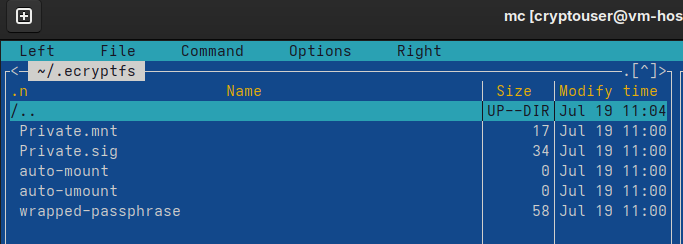
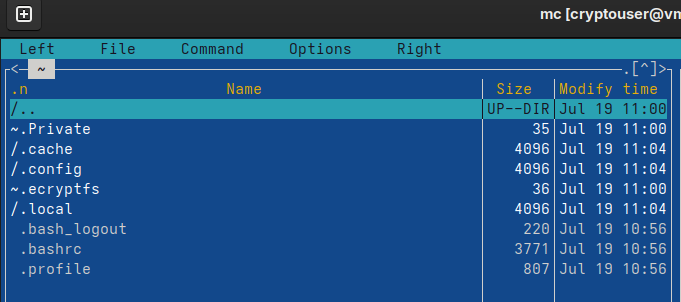
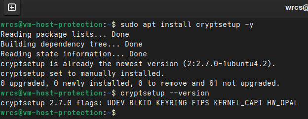
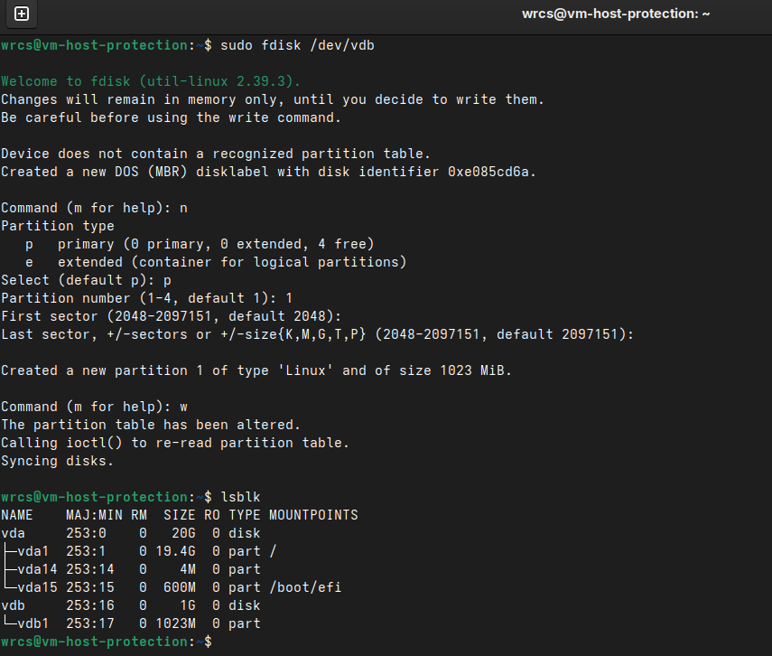
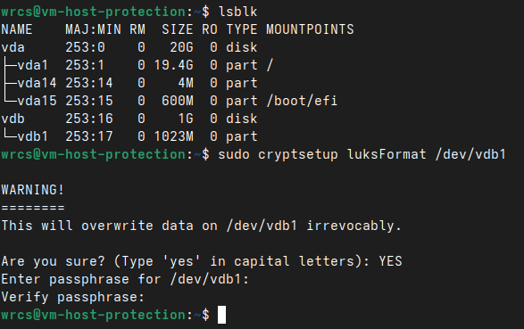

# Домашнее задание к занятию «Защита хоста» - Малявко Сергей (netology)

### Задание 1
1. Установите eCryptfs.
2. Добавьте пользователя cryptouser.
3. Зашифруйте домашний каталог пользователя с помощью eCryptfs.

В качестве ответа пришлите снимки экрана домашнего каталога пользователя с исходными и зашифрованными данными.

### Выполнение задания 1

##### Скриншот исходных данных

##### Скриншот зашифрованных данных

### Задание 2

1. Установите поддержку LUKS.
2. Создайте небольшой раздел, например, 100 Мб.
3. Зашифруйте созданный раздел с помощью LUKS.

В качестве ответа пришлите снимки экрана с поэтапным выполнением задания.

### Выполнение задания 2

##### 1 Скриншот установки LUKS

##### 2 Создайте небольшой раздела 1G

##### 3 Зашифровка раздела с помощью LUKS.

